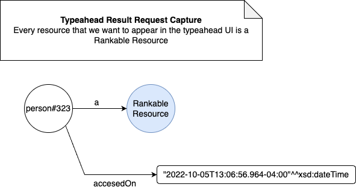

## Quickstart Instructions

This is a test suit to prove that PageRank (implement by Spark's GraphX library) can be used in conjunction with Semantic graph (implemented by Stardog) to create a richer search experience to the end user.

## Benefits

- (this example) typeahead with semantic search
- search can run with user personas (personas have attributes like: roles, responsibilities, and interests)
- Fast search using predictive analytics
- displays important resource (ranked by the users)


## 1. Environment Setup

The following steps need to be taken in order to setup your environment to be able to run the examples in this project successfully.

- Install Stardog

- Install Apache Spark

  In the demo directory, to ensure that your environment can find and run Spark  run `spark-shell`. If it works, exit the Spark shell by typing `:quit`. 

  If Spark complains that it can't initialize the session due to a missing `.spark_events` file, run `mkdir .spark_events` in your working folder.

- Install Scala

- Download the [Stardog Spark Connector (version 1.0.1)](https://stardog-spark-connector.s3.amazonaws.com/stardog-spark-connector-1.0.1.jar) jar needed to connect Stardog and Spark. The jar should be placed in the root of the project directory.

- Configure the parameters for your Spark job in a routers.properties file.
  > Note: The router.properties that ships with this project is setup for a local development environment

## Theory

> UPDATE - We don't need pagerank or Spark in order to implement a user-based scoring system to rank graph resources. However we do need it when we want to rank resources in terms of their connections to other resources.

Page-Rank with full-text search -- typeahead test suit. Three rules to typeahead, which boil down to 1 sparql query per rule (ideally) which get fired off to Stardog when the (QUERYABLE condition is met). The proxy-application will log the request and who made it then query Stardog and return results to the client application. The proxy-application will refresh the metadata (as in run page rank to rank what resources are most important) (maybe more of a dance than quick exchange, so if the client doesn't need that much info then the app doesn't need to really dig that deep but if the client starts drilling down then the app will do that just in time) So were pageranking not just resources themselves but also their classes and their related classes, and their related nodes.-- (but first the resources) -- The app needs to be the record keeper and every time it send data it basically give all the value away. The client gets data but it has to pay in the voting with your feet principle. So in a typeahead the client will tee off with `sem` to be greeted with `semaphore` or `seminole` or `semana` but before it is the app should take that as an opportunity to log that resource request. `sem` as a resource. Because down the road maybe `sem` is accessed 100 times over than `cat` or  `sam`. The next opportunity to score is the choosing, or manual completion, of a resource. After choosing that resource 10 times in a day that resource should be more important than the rest and that should be logged so that when it is searched an eleventh time and `sem` is typed the resource `semaphore` is ranked straight to the top. This application-client architecture has the concept of Trade written all over it. The client wants and must pay in some way and the app has and must charge in some way. If the app just gives then it won't be able to charge later so thats a loss for the app. If the client pays upfront and gets nothing (for whatever reason) then it lost. But the app and the client must be in a win-win to make this architecture work.

```
:rankable-resource-1 a :RankableResource ;
:accessedOn "03-10-2022T12:48:00"^^xsd:dateTime ; # new triple on new access
:accessedOn "03-10-2022T11:48:00"^^xsd:dateTime ;
:accessedOn "03-10-2022T10:48:00"^^xsd:dateTime .
```

More on the drilling piece, the app can also log the class of the resource, or even the context so that way when were beinging from a initial search the app will know what classes or context are most popular already and have those ready. (Note that some classes and context are important to some users and not others)---> Enter user perspective in this architecture


### Typeahead - Theory

#### Substring Matching

If the resource you want is `New Jersey` and you type: `New Jersey`, `Jersey`, or `New` then you should get: `New Jersey` in the typeahead results.


### Tests

#### TRRC - Typeahead Result Request Capture

This feature will be dependent on capturing user metadata. 

```
Note

Consider the two independent scores that are generated, one from Lucene and the aggregate count of how many times the resource was accessed. We may want to place a certain weight on one score over the other. If this is the case then that logic should live in the graph not in the query becasue it may have to change depending on the usecase.
```




1. A search is executed using the string `'Star'`

2. A resource is chosen (`<http://api.stardog.com/person#323>` )

   > This is a simulated event

3. The chosen resource is logged with a timestamp

4. The same search is executed again with the same string `'Star'`

5. The resource (`<http://api.stardog.com/person#323>`) now appears at the top of the results.


## Experience examples

This example show a basic type-ahaead

https://codepen.io/inimistschool/pen/PvBzYe

They one shows the substring matching feature.

Type: `New Jer`, `Jer`, or `New` then you should get: `New Jersey` in the typeahead results.

https://codepen.io/mcguiretj/pen/QVgmoq


